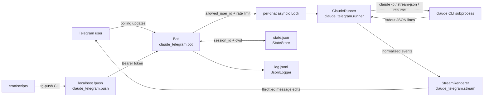

# claude-telegram

[](https://github.com/NickBell123/claude-telegram/actions/workflows/tests.yml)
[](LICENSE)

Telegram bridge to the `claude` CLI. Talk to Claude Code from your phone with full skill/MCP parity. Bonus: a localhost push endpoint so cron jobs can DM you.

## 30-second overview

`claude-telegram` is a small Python service for a single operator. It polls Telegram, accepts messages only from one configured user ID, runs the real `claude` CLI as a subprocess, and streams Claude Code's `stream-json` output back by editing Telegram messages in place. It also exposes a bearer-protected localhost `/push` endpoint so scripts and cron jobs can send Telegram notifications through the same bot.

The bridge deliberately wraps the installed CLI instead of reimplementing Claude Code behavior. That keeps the runtime close to an interactive `claude` session: the same binary, local config, skills, MCP servers, hooks, and working directory semantics are used.

## Architecture



## Engineering highlights

- **Authentication boundary:** Telegram messages are ignored unless `effective_user.id` matches `ALLOWED_USER_ID`; the push endpoint validates a bearer token with `hmac.compare_digest` and defaults to `127.0.0.1:8787`.
- **Subprocess streaming:** each Claude turn starts `claude -p ... --output-format stream-json --verbose --dangerously-skip-permissions`, normalizes session/text/tool/result/error events, drains stderr concurrently, keeps a bounded stderr tail, and surfaces non-zero exits as stream errors.
- **Concurrency and cancellation:** each chat has an `asyncio.Lock`, each turn receives a fresh `ClaudeRunner`, and `/stop` terminates only the current runner for that chat.
- **Secret-safe logging:** application logging raises `httpx` to `WARNING` so Telegram request URLs do not write the bot token to the journal; the JSONL event log records operational events and may include inbound message text.
- **Tests and CI:** pytest covers auth, commands, state persistence, rate limiting, push auth/chunking, renderer streaming, runner subprocess/error cleanup, per-chat cancellation, logging configuration, and the `tg-push` CLI. GitHub Actions installs `requirements-dev.txt` on Python 3.12 and runs `pytest`.

## Requirements

- Linux with a systemd user session (`systemctl --user`)
- Python 3.12+
- The [`claude` CLI](https://claude.com/claude-code), installed and authenticated

## Install

```bash
git clone https://github.com/NickBell123/claude-telegram ~/claude-telegram
cd ~/claude-telegram
./scripts/install.sh
```

You'll be prompted for:
- **Telegram bot token** — create one via [@BotFather](https://t.me/BotFather).
- **Your Telegram user ID** — DM [@userinfobot](https://t.me/userinfobot) to get it.

The installer writes `~/.claude-telegram/env`, installs `tg-push` to `~/.local/bin/`, enables a user systemd service, and starts it.

## Commands

- `/reset` — clear the conversation, start fresh
- `/cd <path>` — change Claude's working directory for this chat
- `/cwd` — show current working directory
- `/cost` — show cost of the last turn
- `/stop` — interrupt the in-flight turn

## Pushing from cron

```bash
echo "BTC +2.1%" | tg-push
tg-push --title "Morning brief" --file /tmp/brief.md
```

`examples/morning-brief.sh` is a worked example: a cron job that runs `claude -p`
headless and delivers the result to Telegram, including the PATH handling cron
needs and a failure path so a broken job doesn't fail silently.

## Files

- `~/.claude-telegram/env` — config (chmod 600)
- `~/.claude-telegram/state.json` — per-chat session IDs and cwd
- `~/.claude-telegram/log.jsonl` — append-only event log

## Logs

```bash
journalctl --user -u claude-telegram -f
tail -f ~/.claude-telegram/log.jsonl
```

## Development

```bash
python3 -m venv .venv
.venv/bin/pip install -r requirements-dev.txt
.venv/bin/pytest
```

## Safety

- Only the configured `ALLOWED_USER_ID` can talk to the bot. Other users are dropped silently.
- The push endpoint binds to `127.0.0.1` only and requires a bearer token.
- `claude` runs with `--dangerously-skip-permissions`. Same blast radius as you running Claude Code interactively. If your phone is lost, revoke the bot token via @BotFather.
- Built for a single operator. One `claude` subprocess runs at a time per chat; `/stop` targets the in-flight turn.

## License

MIT — see [LICENSE](LICENSE).
